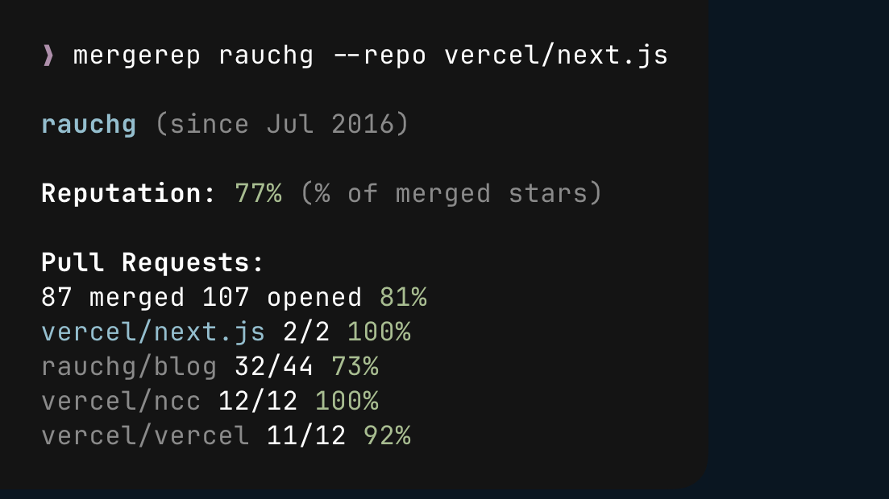

<div align='center'>
    <br/>
    <br/>
    <h3>mergerep</h3>
    <p>CLI for open-source contribution stats</p>
    <br/>
    <br/>
</div>

Check a contributor's merge rates before spending time on their LLM slop pull request.

## Install

```bash
bun install -g mergerep
npm install -g mergerep
pnpm install -g mergerep
```

Requires [Bun](https://bun.sh/) and [GitHub CLI](https://cli.github.com/).

## Usage

```bash
mergerep <username>                  # Check user's merge rate
mergerep                             # In PR branch, check PR author
mergerep <username> --json           # JSON output
mergerep <username> --issues         # Include issues
mergerep <username> --repo org/name  # Highlight specific repo
```

## Example



## License

[MIT](LICENSE)
